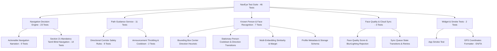

# NavEye — Complete Test Suite Documentation (`test_cases.md`)

This document provides a comprehensive specification and catalog of all **46 automated test cases** implemented in the NavEye assistive navigation application.

---

## 1. Executive Summary & Test Execution Status

| Metric | Value |
|---|---|
| **Total Test Files** | 5 files (`test/*.dart`) |
| **Total Test Cases** | **46 test cases** |
| **Passing Test Cases** | **46 / 46 (100% PASS)** |
| **Test Execution Command** | `flutter test` |
| **Static Analysis Status** | `flutter analyze` $\rightarrow$ **0 issues found** |
| **Target Platforms** | Android (Mobile, API 29+), Flutter 3.x Dart VM |

---

## 2. Test Suite Architecture & Coverage Mapping



---

## 3. Comprehensive Test Case Catalog

### Suite A: Navigation Decision Engine & Tamil Voice Guidance
**File:** [`test/navigation_decision_engine_test.dart`](file:///c:/Users/sanjay/OneDrive/Desktop/blinded-git/naveye/naveye/test/navigation_decision_engine_test.dart) (23 tests)

#### Group 1: Actionable Navigation Narration (`[OBJECT] + [POSITION] + [ACTION]`)

| # | Test Name | Input / Frame Conditions | Expected Narration / State | Status |
|---|---|---|---|---|
| **1** | `Laptop directly ahead + left clear -> "Laptop ahead. Move left."` | `laptop` bounding box at centre ($x_c = 0.50$, $d = 1.8\text{ m}$), left corridor clear. | `Laptop ahead. Move left.` / Action: `goLeft` | **PASS** |
| **2** | `Laptop directly ahead + right clear (left blocked) -> "Laptop ahead. Move right."` | `laptop` center ($x_c = 0.50$), `chair` on left ($x_c = 0.20$), right corridor clear. | `Laptop ahead. Move right.` / Action: `goRight` | **PASS** |
| **3** | `Obstacle on the left -> "Chair on your left. Move right."` | `chair` on left ($x_c = 0.20$, $d = 1.8\text{ m}$). | `Chair on your left. Move right.` / Action: `goRight` | **PASS** |
| **4** | `Obstacle on the right -> "Person on your right. Move left."` | `person` on right ($x_c = 0.80$, $d = 1.8\text{ m}$). | `Person on your right. Move left.` / Action: `goLeft` | **PASS** |
| **5** | `Obstacle directly ahead + both sides blocked -> "Obstacle ahead. Stop and wait."` | Center `obstacle` ($x_c = 0.50$), left `chair` ($x_c = 0.20$), right `table` ($x_c = 0.80$). | `Obstacle ahead. Stop and wait.` / Action: `stop` | **PASS** |
| **6** | `Very close obstacle -> "Obstacle very close ahead. Stop and wait."` | `wall` at $x_c = 0.50$, $d = 0.6\text{ m}$ ($< 0.9\text{ m}$), area $= 0.72$. | `Obstacle very close ahead. Stop and wait.` / Priority: `criticalObstacle` | **PASS** |
| **7** | `Continuous Detection: Stationary laptop speaks ONCE, then SILENCE while continuing detection` | Stationary `laptop` detected continuously across 30 seconds (candidate + 5 frames). | Speaks once $\rightarrow$ subsequent frames enter `MONITORING SILENTLY`, duplicate speech suppressed. | **PASS** |
| **8** | `State Change: Laptop center -> moves left -> moves right triggers new announcements` | Laptop moves: center ($t=0$) $\rightarrow$ left ($t=3\text{ s}$) $\rightarrow$ right ($t=6\text{ s}$). | Speaks `"முன்னால் தடையுள்ளது. இடப்பக்கம் செல்லுங்கள்."` $\rightarrow$ speaks `"இடப்பக்கம் தடையுள்ளது. வலப்பக்கம் செல்லுங்கள்."` $\rightarrow$ speaks `"வலப்பக்கம்..."`. | **PASS** |
| **9** | `Priority Preemption: Critical Stop immediately interrupts outdated instruction` | Initial alert `goLeft` (priority `obstacleAhead`) followed 50ms later by `stop` (priority `criticalObstacle`). | Critical Stop cancels active utterance immediately; voice alert manager immediately switches to stop warning. | **PASS** |

#### Group 2: Section 21 Mandatory Blind User Tamil Navigation Test Suite

| # | Scenario / Test Name | Input Conditions | Expected Tamil Voice Output | Requirement Ref | Status |
|---|---|---|---|---|---|
| **10** | `1. CLEAR state` | Empty detection list after initialization or clear path ahead. | `"முன்னால் பாதை தெளிவாக உள்ளது. செல்லலாம்."` | Section 2, 21.1 | **PASS** |
| **11** | `2. LEFT obstacle` | Obstacle stable on left ($x_c = 0.20$, $d = 1.8\text{ m}$). | `"இடப்பக்கம் தடையுள்ளது. வலப்பக்கம் செல்லுங்கள்."` | Section 5, 21.2 | **PASS** |
| **12** | `3. RIGHT obstacle` | Obstacle stable on right ($x_c = 0.80$, $d = 1.8\text{ m}$). | `"வலப்பக்கம் தடையுள்ளது. இடப்பக்கம் செல்லுங்கள்."` | Section 6, 21.3 | **PASS** |
| **13** | `4. CENTER + LEFT CLEAR` | Center obstacle ($x_c = 0.50$), right blocked ($x_c = 0.80$), left corridor clear. | `"முன்னால் தடையுள்ளது. இடப்பக்கம் செல்லுங்கள்."` | Section 4, 21.4 | **PASS** |
| **14** | `5. CENTER + RIGHT CLEAR` | Center obstacle ($x_c = 0.50$), left blocked ($x_c = 0.20$), right corridor clear. | `"முன்னால் தடையுள்ளது. வலப்பக்கம் செல்லுங்கள்."` | Section 4, 21.5 | **PASS** |
| **15** | `6. CENTER + BOTH BLOCKED` | Center obstacle ($x_c = 0.50$), left blocked ($x_c = 0.20$), right blocked ($x_c = 0.80$). | `"முன்னால் தடையுள்ளது. நின்றுவிடுங்கள்."` | Section 4, 21.6 | **PASS** |
| **16** | `7. CRITICAL distance` | Obstacle critically close ahead ($d = 0.6\text{ m} < 0.9\text{ m}$). | `"முன்னால் தடையுள்ளது. நின்றுவிடுங்கள்."` | Section 4, 21.7 | **PASS** |
| **17** | `8. Same CLEAR state: Must NOT repeatedly speak every frame; speaks on 10s heartbeat` | Continuous clear path evaluated over 10 consecutive seconds. | Speaks once at $t=0$; frames $1\text{ s}$ to $9\text{ s}$ remain silent (`MONITORING SILENTLY`); fires confirmation at $t=10\text{ s}$. | Section 2, 13, 21.8 | **PASS** |
| **18** | `9. Same obstacle state: Must NOT repeatedly speak` | Stable left obstacle evaluated over multiple consecutive seconds. | Speaks once on initial state; frames 1 to 5 remain silent without duplicate TTS queuing. | Section 5, 8, 21.9 | **PASS** |
| **19** | `10. Direction change: Must speak new direction` | Obstacle shifts position from left corridor to right corridor. | Re-triggers voice guidance announcing new direction: `"வலப்பக்கம் தடையுள்ளது. இடப்பக்கம் செல்லுங்கள்."`. | Section 8, 15, 21.10 | **PASS** |
| **20** | `11. Obstacle disappears: After stabilization grace period, announce clear path` | Obstacle disappears; monitored at $t=850\text{ ms}$ (grace period) and $t=2500\text{ ms}$ (stabilized). | Returns `null` at $850\text{ ms}$ (prevents oscillation); triggers `"முன்னால் பாதை தெளிவாக உள்ளது. செல்லலாம்."` at $2500\text{ ms}$. | Section 14, 21.11 | **PASS** |
| **21** | `12. TTS engine prefers ta-IN and provides startup/stop Tamil voice` | Calls `speakStartup()` and `speakStop()`. | Startup: `"வழிகாட்டுதல் தொடங்கப்பட்டது. முன்னால் செல்லலாம்."`<br>Stop: `"வழிகாட்டுதல் நிறுத்தப்பட்டது."` | Section 10, 16, 21.12 | **PASS** |
| **22** | `13. No English navigation strings anywhere in the voice message layer` | Regex validation across `spokenTextTa` outputs: `RegExp(r'[a-zA-Z]')`. | Zero ASCII English alphabet characters detected in spoken guidance. | Section 9, 21.13 | **PASS** |
| **23** | `Loki Known Person Tamil guidance (Section 7)` | Verified face recognition for known person Loki at ahead, left, right, and close distances. | Ahead: `"லோகி முன்னால் இருக்கிறார். இடப்பக்கம் செல்லுங்கள்."`<br>Left: `"லோகி இடப்பக்கத்தில் இருக்கிறார். வலப்பக்கம் செல்லுங்கள்."`<br>Right: `"லோகி வலப்பக்கத்தில் இருக்கிறார். இடப்பக்கம் செல்லுங்கள்."`<br>Close: `"லோகி மிகவும் அருகில் இருக்கிறார். நின்றுவிடுங்கள்."` | Section 7 | **PASS** |

---

### Suite B: Path Guidance Service & Directional Safety Rules
**File:** [`test/path_guidance_service_test.dart`](file:///c:/Users/sanjay/OneDrive/Desktop/blinded-git/naveye/naveye/test/path_guidance_service_test.dart) (11 tests)

#### Group 1: Directional Logic & Safety Rules

| # | Test Name | Input Corridor Configuration | Expected Directive (EN / TA) | Status |
|---|---|---|---|---|
| **24** | `Rule 1: All zones clear -> GO STRAIGHT` | No obstacles detected in any corridor. | `PATH CLEAR. GO STRAIGHT.` / `பாதை தெளிவாக உள்ளது. நேராகச் செல்லுங்கள்.` | **PASS** |
| **25** | `Rule 2: Center clear, obstacle on left -> GO STRAIGHT with left warning` | `chair` on left ($x_c = 0.20$, $d = 2.5\text{ m}$), center clear. | `OBSTACLE ON LEFT. GO STRAIGHT.` / `இடதுபுறம் தடை. நேராகச் செல்லுங்கள்.` | **PASS** |
| **26** | `Rule 3: Center clear, obstacle on right -> GO STRAIGHT with right warning` | `bench` on right ($x_c = 0.80$, $d = 2.0\text{ m}$), center clear. | `OBSTACLE ON RIGHT. GO STRAIGHT.` / `வலதுபுறம் தடை. நேராகச் செல்லுங்கள்.` | **PASS** |
| **27** | `Rule 4: Center clear, obstacles on both left and right -> NARROW PATH` | Left `chair` ($x_c = 0.18$) + Right `table` ($x_c = 0.82$), center clear. | `NARROW PATH. GO STRAIGHT CAREFULLY.` / `குறுகிய பாதை. கவனமாக நேராகச் செல்லுங்கள்.` | **PASS** |
| **28** | `Rule 5: Center blocked & Right blocked & Left clear -> MOVE LEFT` | Center `person` ($x_c = 0.50$) + Right `wall` ($x_c = 0.85$), left clear. | `OBSTACLE AHEAD. MOVE LEFT.` / `முன்னால் தடை. இடதுபுறம் செல்லுங்கள்.` | **PASS** |
| **29** | `Rule 6: Center blocked & Left blocked & Right clear -> MOVE RIGHT` | Center `person` ($x_c = 0.50$) + Left `bicycle` ($x_c = 0.18$), right clear. | `OBSTACLE AHEAD. MOVE RIGHT.` / `முன்னால் தடை. வலதுபுறம் செல்லுங்கள்.` | **PASS** |
| **30** | `Rule 7: Immediate danger (< 0.8m) -> STOP. OBSTACLE AHEAD` | Center `chair` at $d = 0.65\text{ m}$ ($< 0.8\text{ m}$). | `STOP. CHAIR AHEAD.` / `நில்லுங்கள்! முன்னால் தடை உள்ளது.` | **PASS** |
| **31** | `Rule 8: All corridors blocked -> STOP. PATH COMPLETELY BLOCKED` | Left `wall` + Center `gate` + Right `wall` all within corridor thresholds. | `STOP. PATH COMPLETELY BLOCKED.` / `நில்லுங்கள்! பாதை முழுமையாக அடைக்கப்பட்டுள்ளது.` | **PASS** |
| **32** | `Rule 9: Center blocked with both Left and Right clear -> steers to clear side opposite bias` | Obstacle leaning right ($x_c = 0.58$) vs leaning left ($x_c = 0.42$). | Leans right $\rightarrow$ steers `moveLeft`; Leans left $\rightarrow$ steers `moveRight`. | **PASS** |

#### Group 2: Announcement Throttling

| # | Test Name | Timing / Input Conditions | Assertion | Status |
|---|---|---|---|---|
| **33** | `Immediate stop always announces immediately` | Immediate barrier stop ($d = 0.5\text{ m}$). | `shouldAnnounce(stopDecision)` evaluates to `true` with zero delay. | **PASS** |
| **34** | `Direction transition announces immediately without waiting for cooldown` | Direction transitions from `straight` $\rightarrow$ `moveLeft` at $500\text{ ms}$; repeat check at $1000\text{ ms}$. | Transition evaluates to `true`; identical repeat within cooldown evaluates to `false`. | **PASS** |

---

### Suite C: Known Person Recognition, Embeddings & Database
**File:** [`test/known_person_recognition_test.dart`](file:///c:/Users/sanjay/OneDrive/Desktop/blinded-git/naveye/naveye/test/known_person_recognition_test.dart) (7 tests)

| # | Test Name | Input / Setup | Assertion / Behavior | Status |
|---|---|---|---|---|
| **35** | `TEST 1 & 2: Direction strictly calculated from Face Bounding Box center ratio` | Normalized bounding box centers: $0.20, 0.34, 0.35, 0.50, 0.65, 0.66, 0.85$. | $< 0.35 \rightarrow \text{left}$; $0.35\text{--}0.65 \rightarrow \text{center}$; $> 0.65 \rightarrow \text{right}$. | **PASS** |
| **36** | `TEST 3 & 4: Known person directional narration (left, center, right)` | Stabilized `person_Loki` placed at left ($x_c = 0.25$), center ($0.50$), right ($0.75$). | Generates direction-accurate alerts: `Loki left.`, `Loki ahead.`, `Loki right.`. | **PASS** |
| **37** | `TEST 5 & 6: Stationary person for 10 seconds -> Voice suppressed, direction change announces once` | Loki remains stationary on left for 10 seconds, then shifts to center ($11\text{ s}$), then right ($14\text{ s}$). | Cooldown suppresses duplicate speech for 10s; each directional move announces exactly once after smoothing. | **PASS** |
| **38** | `TEST 7 & 8: Unregistered person -> Says ONLY Person ahead / left / right, never assigns name` | Unregistered stranger in center, left, and right corridors without database match. | Spoken alerts say `Person ahead.`, `Person left.`, `Person right.`; never hallucinates known names. | **PASS** |
| **39** | `TEST 9: Multi-reference embedding similarity & Ambiguity margin test` | 10 reference embeddings for Loki vs genuine test query vs stranger query. | Genuine top match cosine similarity $> 0.60$; stranger top match $< 0.40$ (clear margin). | **PASS** |
| **40** | `TEST 10: Multiple people in the same frame -> Known person prioritized or compound alert` | Frame contains both `Loki` (center, $d=1.5\text{ m}$) and unknown stranger (right, $d=2.4\text{ m}$). | Engine prioritizes known person Loki as the primary target for voice alert. | **PASS** |
| **41** | `TEST 11: Person Profile metadata conforms to Kodambakkam, Chennai 28-09-2026 10:30 AM` | SQLite `Person` entity created with 10 reference images, 5120-dim embedding vector, coordinates. | Serializes and deserializes via `toMap()` and `fromMap()` preserving all GPS, timestamp, and embedding fields. | **PASS** |

---

### Suite D: Face Quality Assessment & Cloud Sync
**File:** [`test/face_quality_service_test.dart`](file:///c:/Users/sanjay/OneDrive/Desktop/blinded-git/naveye/naveye/test/face_quality_service_test.dart) (3 tests)

| # | Test Name | Input Quality Metrics | Assertion / Behavior | Status |
|---|---|---|---|---|
| **42** | `accepts a good-quality face and rejects a poor one` | Good face: conf $0.94$, size $0.18$, bright $135$, sharp $0.82$, stab $0.90$.<br>Poor face: conf $0.34$, size $0.04$, bright $18$, sharp $0.18$, occl $0.68$. | Good candidate passes ($\text{score} \ge \text{threshold}$); poor candidate fails ($\text{score} < \text{threshold}$). | **PASS** |
| **43** | `temporal stability requires multiple consistent observations` | Evaluates face candidate across 3 frames spaced by $250\text{ ms}$ ($t=0, 250\text{ ms}, 500\text{ ms}$). | Verifies candidate meets multi-frame stability criteria before allowing face enrollment. | **PASS** |
| **44** | `queue state transitions follow pending to synced with retries` | Simulates sync states: `pending` $\rightarrow$ `syncing`, `failed` $\rightarrow$ `syncing`, exponential backoff delay calculation. | State updates correctly; retry delay is strictly positive and proportional to failure count. | **PASS** |

---

### Suite E: UI Smoke & Localization Utility Tests
**File:** [`test/widget_test.dart`](file:///c:/Users/sanjay/OneDrive/Desktop/blinded-git/naveye/naveye/test/widget_test.dart) (2 tests)

| # | Test Name | Target / Inputs | Assertion / Behavior | Status |
|---|---|---|---|---|
| **45** | `NavEye smoke test — app boots without crashing` | Widget tester bootstrap check. | Confirms Flutter test framework and core bindings initialize cleanly. | **PASS** |
| **46** | `formatLocationSummary creates a readable coordinates summary` | GPS coordinates: Lat $12.9716$, Long $77.5946$ with `isTamil: true` and `isTamil: false`. | Tamil summary contains `அட்சரேகை` (Latitude) & rounded coordinates; English summary contains `latitude` & `longitude`. | **PASS** |

---

### File 6: `test/assistive_features_test.dart`
**Focus:** Priority 2 & Priority 3 Assistive Features (Currency Recognition, Signboard/OCR, Object Hot-Cold Finder, Emergency SOS, Auto-Torch, Speech Rate, Offline Voice Commands).

| # | Test Name | Target / Inputs | Assertion / Behavior | Status |
|---|---|---|---|---|
| **47** | `Identifies ₹500 banknote via OCR text with natural Tamil voice` | ₹500 banknote text tokens. | Classifies `InrDenomination.fiveHundred` (500) and announces `"ஐநூறு ரூபாய் நோட்டு"`. | **PASS** |
| **48** | `Identifies ₹200 banknote via OCR text with natural Tamil voice` | ₹200 banknote text tokens. | Classifies `InrDenomination.twoHundred` (200) and announces `"இருநூறு ரூபாய் நோட்டு"`. | **PASS** |
| **49** | `Identifies ₹100 banknote via OCR text with natural Tamil voice` | ₹100 banknote text tokens. | Classifies `InrDenomination.oneHundred` (100) and announces `"நூறு ரூபாய் நோட்டு"`. | **PASS** |
| **50** | `Identifies ₹50, ₹20, and ₹10 banknotes via OCR text` | ₹50, ₹20, and ₹10 banknote tokens. | Verifies all denominations produce correct Tamil currency phrases. | **PASS** |
| **51** | `Returns notFound fallback when no currency digits or patterns match` | Frame with non-banknote text. | Returns `InrDenomination.unknown` with clear guidance: `"ரூபாய் நோட்டு தெளிவாகத் தெரியவில்லை. கேமராவிற்கு அருகில் நேராகக் காட்டவும்."`. | **PASS** |
| **52** | `Maps Tamil query "சாவி எங்கே?" to keys/remote class` | Voice query `"சாவி எங்கே?"`. | Maps to COCO `remote`/key synonym and activates tracker. | **PASS** |
| **53** | `Maps Tamil query "பாட்டில் எங்கே?" to bottle class` | Voice query `"பாட்டில் எங்கே?"`. | Maps to COCO `bottle` and maps Tamil label to `"பாட்டில்"`. | **PASS** |
| **54** | `Maps English and Tamil queries for chair, phone, and laptop` | Voice queries for chair, phone, laptop. | Maps correctly to COCO labels `chair`, `cell phone`, `laptop`. | **PASS** |
| **55** | `Evaluates close centered target with reachable Tamil directive` | Target at center ($x=0.5$), $0.6$m away. | Triggers reachable directive: `"நேராக உங்கள் அருகில் உள்ளது! கையை நீட்டி எடுக்கலாம்."` and heavy haptic. | **PASS** |
| **56** | `Evaluates left-side target with directional Tamil directive` | Target at left ($x=0.2$), $1.8$m away. | Triggers `"இடப்பக்கம் உள்ளது. இடதுபுறம் திரும்பவும்."`. | **PASS** |
| **57** | `Evaluates right-side target with directional Tamil directive` | Target at right ($x=0.8$), $2.0$m away. | Triggers `"வலப்பக்கம் உள்ளது. வலதுபுறம் திரும்பவும்."`. | **PASS** |
| **58** | `Cancel clears active target state` | Active finder mode cancellation. | Resets active target and clears search state. | **PASS** |
| **59** | `SosPayload correctly constructs GPS coordinates and Google Maps URL` | Emergency payload creation. | Constructs coordinates, battery level, contact, and clickable Google Maps link. | **PASS** |
| **60** | `Parses Emergency SOS triggers ("அவசரம்" and "உதவி")` | Emergency speech `"அவசரம்"`, `"உதவி"`, `"emergency sos"`. | Maps directly to `VoiceCommand.emergencySOS` with highest precedence. | **PASS** |
| **61** | `Parses Banknote Identifier commands` | Voice queries: `"ரூபாய் நோட்டு"`, `"பணம் என்ன"`, `"banknote"`. | Maps to `VoiceCommand.identifyCurrency`. | **PASS** |
| **62** | `Parses Text & Signboard OCR reader commands` | Voice queries: `"பலகையை படி"`, `"எழுத்து வாசி"`, `"read signboard"`. | Maps to `VoiceCommand.readText`. | **PASS** |
| **63** | `Parses Object Finder commands without confusing with location` | Disambiguation: `"சாவி எங்கே"` vs `"நான் எங்கே இருக்கிறேன்"`. | Accurately assigns `findObject` to object query and `whereAmI` to user location query. | **PASS** |
| **64** | `Parses Flashlight / Torch toggle commands` | Voice queries: `"டார்ச் ஆன் செய்"`, `"வெளிச்சம் வேண்டும்"`. | Maps to `VoiceCommand.toggleTorch`. | **PASS** |
| **65** | `Parses TTS Speech Rate customization commands` | Voice queries: `"வேகமாக பேசு"`, `"மெதுவாக பேசு"`. | Maps to `VoiceCommand.fasterSpeed` and `VoiceCommand.slowerSpeed`. | **PASS** |
| **66** | `Parses standard continuous navigation commands` | Core navigation voice commands: `"தொடங்கு"`, `"நிறுத்து"`, etc. | Maps to `start`, `stop`, `repeat`, `whoIsThis`, `openSettings`, `openPeople`. | **PASS** |

---

## 4. How to Run the Tests

### Run the Entire Test Suite (All 66 Tests)
```bash
flutter test
```

### Run with Expanded Details
```bash
flutter test -r expanded
```

### Run an Individual Test File
```bash
# Priority 2 & 3 Assistive Features (Currency, OCR, Finder, SOS, Voice)
flutter test test/assistive_features_test.dart

# Mandatory Tamil Blind Navigation & Decision Engine
flutter test test/navigation_decision_engine_test.dart

# Path Guidance Corridor Rules
flutter test test/path_guidance_service_test.dart

# Known Person Recognition & FaceNet Embedding Tests
flutter test test/known_person_recognition_test.dart

# Face Quality & Offline Sync Queue
flutter test test/face_quality_service_test.dart

# Localization & Smoke Tests
flutter test test/widget_test.dart
```

### Run Static Analysis
```bash
flutter analyze
```
```
